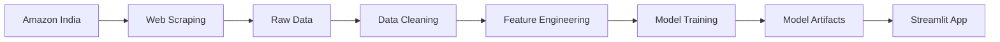

# 🎧 NexTune — Bluetooth Headphones Price Predictor

<div align="center">


**An ML-powered system for predicting optimal prices of Bluetooth headphones in the Indian market**

[](https://www.python.org/downloads/)
[](https://streamlit.io)
[](https://scikit-learn.org/)
[](https://opensource.org/licenses/MIT)

[Features](#-features) • [Installation](#-installation) • [Usage](#-usage) • [Model Performance](#-model-performance) • [Contributing](#-contributing)

</div>

---

## 🎯 Overview

NexTune helps price new Bluetooth headphones in the competitive Indian e-commerce market. By scraping product data from Amazon India, analyzing market trends, and training a Gradient Boosting model on 18 engineered features, the system provides data-driven price recommendations based on product specifications.

### Key Capabilities

- 🕷️ **Automated Web Scraping** — Extract data from Amazon India using BeautifulSoup + Selenium
- 📊 **Comprehensive EDA** — Statistical analysis and visualizations
- 🤖 **ML Price Prediction** — Gradient Boosting model with R² ≈ 0.80, MAPE ≈ 17.6%
- 🎨 **Interactive Web App** — Streamlit UI with dark/light theme and smooth scrolling
- ✅ **Property-Based Testing** — Robust validation with Hypothesis

---

## 💡 Problem Statement

Your company is launching new wireless Bluetooth headphones in the Indian market. The data science team needs to recommend a suitable price based on:

1. **Product Specifications** — Bluetooth version, ANC/ENC, driver size, IPX rating, codec support
2. **Market Demand** — Competitor pricing and customer preferences from Amazon India

**Challenge:** Determine optimal pricing that balances competitiveness with profitability while considering brand tier and market positioning.

---

## ✨ Features

<table>
<tr>
<td width="50%">

### 🔍 Data Collection
- Basic scraper (BeautifulSoup)
- Enhanced scraper (Selenium)
- Smart regex-based extraction
- Automatic unit normalization

</td>
<td width="50%">

### 📈 Data Analysis
- Automated EDA
- Feature engineering
- Missing value handling
- Data quality validation

</td>
</tr>
<tr>
<td width="50%">

### 🧠 Machine Learning
- 18 engineered features
- Gradient Boosting Regressor
- Log-transformed target
- Model serialization

</td>
<td width="50%">

### 🌐 Web Application
- Interactive Streamlit UI
- Dark/light theme toggle
- Smooth scrolling interface
- Real-time predictions

</td>
</tr>
</table>

---

## 🏗️ System Architecture

```
┌─────────────────────────────────────────────────────────────────┐
│                        AMAZON INDIA                             │
│                 (Bluetooth Headphones / Earbuds)                │
└────────────────────────┬────────────────────────────────────────┘
                         │
                         ▼
┌─────────────────────────────────────────────────────────────────┐
│                   DATA COLLECTION LAYER                         │
│  ┌──────────────────┐         ┌──────────────────┐            │
│  │  Basic Scraper   │         │ Enhanced Scraper │            │
│  │ (BeautifulSoup)  │         │   (Selenium)     │            │
│  └──────────────────┘         └──────────────────┘            │
└────────────────────────┬────────────────────────────────────────┘
                         │
                         ▼
┌─────────────────────────────────────────────────────────────────┐
│                      DATA STORAGE                               │
│   headphones-raw.csv → enhanced → combined → final-merged       │
└────────────────────────┬────────────────────────────────────────┘
                         │
                         ▼
┌─────────────────────────────────────────────────────────────────┐
│                 ANALYSIS & TRAINING LAYER                       │
│  ┌──────────────────┐         ┌──────────────────┐            │
│  │   EDA Notebook   │    →    │  Model Training  │            │
│  │  (Jupyter/Colab) │         │  (Scikit-learn)  │            │
│  └──────────────────┘         └──────────────────┘            │
└────────────────────────┬────────────────────────────────────────┘
                         │
                         ▼
┌─────────────────────────────────────────────────────────────────┐
│                    DEPLOYMENT LAYER                             │
│            Streamlit App · app.py · localhost:8501              │
└─────────────────────────────────────────────────────────────────┘
```

---

## 🛠️ Tech Stack

| Component | Technology | Purpose |
|-----------|-----------|---------|
| **Web Scraping** | BeautifulSoup 4, Selenium, undetected-chromedriver | Data extraction from Amazon India |
| **Data Processing** | Pandas, NumPy | Data manipulation and feature engineering |
| **Visualization** | Matplotlib, Seaborn | EDA and insights generation |
| **Machine Learning** | Scikit-learn (GradientBoostingRegressor) | Model training and evaluation |
| **Web Framework** | Streamlit | Interactive web UI with theming |
| **Testing** | Pytest, Hypothesis | Unit and property-based testing |
| **Serialization** | Joblib | Model artifact persistence |

---

## 📁 Project Structure

```
NexTune/
├── 📄 app.py                           # Main Streamlit web application
├── 📄 requirements.txt                 # Python dependencies
├── 📄 README.md                        # Project documentation
├── 📄 LICENSE                          # MIT License
│
├── 📁 assets/
│   └── bg.jpg                          # Background image for UI
│
├── 📁 data/                            # Dataset storage
│   ├── headphones-raw.csv              # Raw scraped data
│   ├── enhanced-headphones-dataset.csv
│   ├── combined-headphones-dataset.csv
│   ├── final-merged-dataset.csv        # Final training dataset
│   └── earbuds_by_company.json
│
├── 📁 models/                          # Trained model artifacts
│   ├── price_predictor.pkl             # Gradient Boosting model
│   ├── scaler.pkl                      # Feature scaler
│   ├── label_encoders.pkl              # Categorical encoders
│   ├── features.pkl                    # Feature list
│   ├── brand_avg.pkl                   # Brand average prices
│   └── brands.json                     # Available brands
│
├── 📁 notebooks/                       # Jupyter notebooks
│   ├── NexTune_Price_Prediction.ipynb  # Main prediction notebook
│   ├── eda_notebook.ipynb              # Exploratory data analysis
│   └── model_training.ipynb            # Model training pipeline
│
├── 📁 scripts/                         # Utility scripts
│   ├── merge_datasets.py               # Dataset merging
│   └── retrain_model.py                # Model retraining
│
├── 📁 src/                             # Source code
│   ├── data/
│   │   └── preparation.py              # Data preprocessing
│   ├── scrapers/
│   │   ├── amazon_scraper.py           # Basic scraper
│   │   └── enhanced_scraper.py         # Selenium scraper
│   └── api/
│       └── templates/
│           └── index.html              # Flask template (optional)
│
└── 📁 tests/                           # Test suite
    └── test_*.py                       # Unit and property tests
```

---

## 🚀 Installation

### Prerequisites

- **Python 3.8+** (tested with Python 3.14)
- **VS Code** (recommended) with Python extension
- **Git** for version control
- Chrome/Chromium browser (optional, for scraper)

### Quick Start

1. **Clone the repository**
```bash
git clone https://github.com/ESpoorthy/NexTune.git
cd NexTune
```

2. **Open in VS Code**
```bash
code .
```

3. **Create and activate virtual environment**
```bash
# Create virtual environment
python3 -m venv .venv

# Activate it
# macOS/Linux:
source .venv/bin/activate

# Windows:
.venv\Scripts\activate
```

4. **Install dependencies**
```bash
pip install -r requirements.txt
```

5. **Retrain the model** (required for first-time setup)
```bash
python3 scripts/retrain_model.py
```

This generates all required model files:
- ✅ `price_predictor.pkl` — Trained Gradient Boosting model
- ✅ `scaler.pkl` — Feature scaler
- ✅ `label_encoders.pkl` — Categorical encoders
- ✅ `features.pkl` — Feature list
- ✅ `brand_avg.pkl` — Brand average prices
- ✅ `brands.json` — Available brands

---

## 📖 Usage

### Running the App from VS Code

#### Method 1: Terminal (Recommended)

1. Open VS Code integrated terminal (`` Ctrl+` `` or `View > Terminal`)

2. Activate virtual environment (if not already active)
```bash
# macOS/Linux
source .venv/bin/activate

# Windows
.venv\Scripts\activate
```

3. Run the Streamlit app
```bash
streamlit run app.py
```

4. Open your browser at:
   - **Local:** `http://localhost:8501`
   - **Network:** `http://192.168.x.x:8501`

#### Method 2: VS Code Launch Configuration

1. Create `.vscode/launch.json`:
```json
{
    "version": "0.2.0",
    "configurations": [
        {
            "name": "Run Streamlit App",
            "type": "python",
            "request": "launch",
            "module": "streamlit",
            "args": ["run", "app.py"],
            "console": "integratedTerminal"
        }
    ]
}
```

2. Press `F5` or go to `Run > Start Debugging`

### Using the App

1. **Select Brand** — Choose from 62 available brands
2. **Set Specifications** — Rating, reviews, Bluetooth version, driver size
3. **Toggle Features** — ANC, ENC, Hi-Res Audio, Spatial Audio, Dual Pairing, Premium Codec, Low Latency, IPX rating, Fast Charging
4. **Adjust Battery Life** — Set expected battery hours
5. **Click Predict Price** — Get instant price prediction with ±10% range

**Features:**
- ✅ Fully scrollable interface
- ✅ Dark/light theme toggle
- ✅ Real-time predictions
- ✅ Price segment badges (Budget/Mid-Range/Premium/Flagship)
- ✅ Battery life analysis

---

## 📊 Model Performance

<table>
<tr>
<td width="50%">

### Metrics

| Metric | Value |
|--------|-------|
| **Algorithm** | GradientBoostingRegressor |
| **R² Score** | ~0.80 |
| **MAPE** | ~17.6% |
| **Features** | 18 engineered |
| **Training Data** | 219 products |
| **Target** | log(price) → expm1 |

</td>
<td width="50%">

### Price Segments

| Segment | Range |
|---------|-------|
| 💚 Budget | < ₹1,000 |
| 💙 Mid-Range | ₹1,000 – ₹3,000 |
| 💜 Premium | ₹3,000 – ₹8,000 |
| 🏆 Flagship | > ₹8,000 |

</td>
</tr>
</table>

### Feature Importance

```
brand_enc / brand_tier    ████████████████████████████████ ~35%
has_anc / anc_db          ████████████████████ ~20%
rating / high_rating      ████████████████ ~16%
bluetooth_version         ████████████ ~12%
driver_size_mm            ████████ ~8%
review_count              ████ ~5%
ipx_level / has_enc       ███ ~4%
```

---

## 🔄 Data Pipeline



1. **Scraping** — Extract 200+ products from Amazon India
2. **Merging** — Combine multiple datasets
3. **Cleaning** — Remove duplicates, handle missing values
4. **Feature Engineering** — Create `brand_tier`, `bt_major`, `high_rating`, binary flags
5. **Training** — Log-transform price, scale features, train model
6. **Serialization** — Save model artifacts with Joblib

---

## 🧪 Testing

```bash
# Run all tests
pytest tests/ -v

# Property-based tests only
pytest tests/ -v -k "property"

# With coverage
pytest tests/ --cov=src --cov-report=html
```

**Property-Based Tests (Hypothesis):**
- ✅ Data serialization round-trips
- ✅ Unit normalization equivalence
- ✅ Missing value handling
- ✅ Deduplication idempotence
- ✅ Train/test split proportions
- ✅ Model prediction validity (₹500 – ₹50,000)
- ✅ Model serialization consistency

---

## 🤝 Contributing

We welcome contributions! Here's how you can help:

1. **Fork the repository**
2. **Create a feature branch**
   ```bash
   git checkout -b feature/amazing-feature
   ```
3. **Commit your changes**
   ```bash
   git commit -m 'Add amazing feature'
   ```
4. **Push to the branch**
   ```bash
   git push origin feature/amazing-feature
   ```
5. **Open a Pull Request**

### Guidelines

- Follow PEP 8 style guide
- Add tests for new features
- Update documentation as needed
- Ensure all tests pass before submitting

---

## 📄 License

This project is licensed under the GPL-3.0 license — see the [LICENSE](LICENSE) file for details.

---

## 🙏 Acknowledgments

- Data sourced from **Amazon India**
- Built with open-source tools and libraries
- Inspired by real-world pricing challenges in Indian e-commerce

---

## 📞 Contact

**Project Maintainer:** [ESpoorthy](https://github.com/ESpoorthy)

**Repository:** [github.com/ESpoorthy/NexTune](https://github.com/ESpoorthy/NexTune)

---

<div align="center">

**Made with ❤️ for data-driven pricing decisions**

⭐ Star this repo if you find it helpful!

</div>
